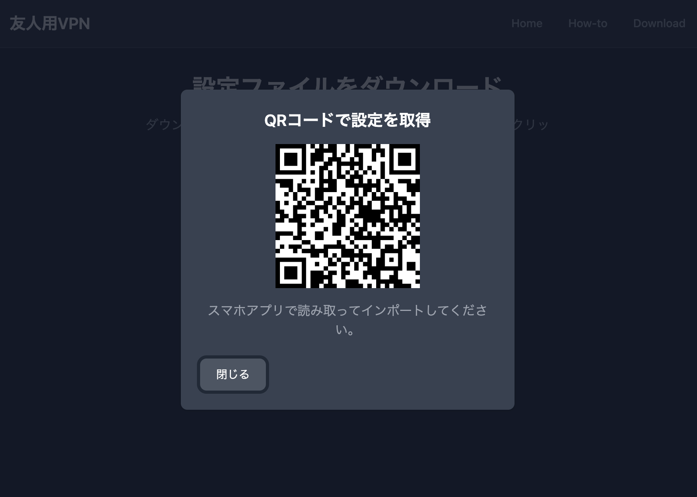

# VPN 配布アプリ（WireGuard用）
このアプリは、WireGuard構成ファイルをQRコードで配布するためのReactアプリです。  
日本の動画サービスなどを海外から快適に利用することを目的として開発しました。

---

##　主な機能
- WireGuard構成ファイルの表示
- QRコードによる構成情報の配布
- PC・スマホ両対応のシンプルなUI

---

##　使用技術
- **React**（UI構築）
- **Vite**（ビルドツール）
- **Docker**（開発環境）
- **AWS S3 + CloudFront**（QRコード配布のホスティング想定）
- 
※ 現在はコストの都合によりAWS上での公開環境は削除しています。

---

## 現在の構成（QRでS3の.confファイルを取得）
- ユーザーが表示されたQRコードをスマホでスキャンすると、
  S3にアップロードされた `.conf` ファイルのURLから直接取得します。
- ダウンロードは事前にアップロードされた静的ファイルに対して行われます。

## 今後の構想（Lambda + API Gatewayによる動的生成）
- 将来的には、ユーザーがアクセスするたびに Lambda関数を通じて `.conf` ファイルを動的に生成。
- 各ユーザーごとに一意のVPN設定ファイルを返す構成を想定しています。

- 構成例：
```text
[ React UI ]
     │
     ▼
[ API Gateway ]
     │
     ▼
[ Lambda（conf生成ロジック） ]
     │
     ▼
[ S3 または即時返却） ]
```

---

## 補足：VPNサーバー構築について（AWS EC2）
本アプリで配布される `.conf` ファイルは、  
AWS EC2 上に自分で構築した WireGuard VPN サーバーに接続するための設定情報です。

構成は以下の通りです：

- **EC2 (Amazon Linux 2)**：VPNサーバーとして使用
- **WireGuard**：手動で設定、ポート開放済み

この構成により、実際にスマホやPCから日本のIP経由で動画サービスなどに接続できるようになっています。

---

## セットアップ方法（ローカル開発用）
このプロジェクトはNode.jsとnpmがインストールされていれば動作します。

### 1. リポジトリをクローン
```bash
git clone https://github.com/yourname/vpn-config-app.git
cd vpn-config-app
```

### 2. 依存パッケージをインストール
```bash
npm install
```

### 3. 開発用サーバーを起動
```bash
npm run dev
```

### 4. ブラウザでアクセス
```
http://localhost:5173
```

---

## スクリーンショット
以下は、実際にQRコードが生成・表示される画面の例です。

### QRコード表示画面（スマホでスキャン可能）

